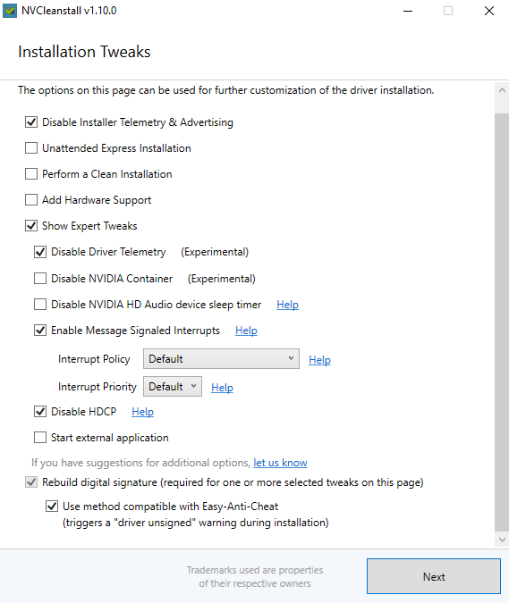

---
# Page title
title: Windows Setup
icon: book

# Title for the menu link if you wish to use a shorter link title, otherwise remove this option.
linktitle: Windows Setup

# Page summary for search engines.
summary: Setting up Windows

# Date page published
date: 2023-04-30
summary: Initial Windows setup and configuration.
# Book page type (do not modify).
type: book

# Position of this page in the menu. Remove this option to sort alphabetically.
weight: 20
---

> **Note** This section needs to be updated with ReviOS procedures.
> 
## Install Apps 
- Winrar 
- Brave
- OpenShell 
- [Snappy Driver Installer](https://sdi-tool.org/)

## Install Drivers
- Realtek Audio Drivers 
- Ethernet LAN Drivers 

### GPU Drivers 
- Integrated GPU drivers (Intel or AMD)
- Discreet GPU drivers install (NVIDIA or AMD)

### [NVCleanInstall](https://www.techpowerup.com/download/techpowerup-nvcleanstall/)  
*automatically selects the driver version and you can turn off telemetry*
- Disable Telemetry 
- Perform clean installation 
- Expert Tweaks 
	- Disable Telemetry 
	- Enable Mesage Signal  interrupts 
	- Disable HDCP 
	- Apply NVENC Video Encoding 
### NVIDIA Control Panel 
- Manage 3D Settings 
	- High performance NVIDIA Processor 
- Low Latency Mode - **Ultra** 
- Power Mode - **Maximum performance** 
- Vertical Sync - **Off**

## Custom Resolution Utility (CRU)
- [Download](https://www.monitortests.com/forum/Thread-Custom-Resolution-Utility-CRU)

#### Display Settings
Verify refresh rate of the monitor 

## Microsoft Redistributables (Optional)
Some games come with these already, but it's likely these will need to be installed.
- Visual C++ Redistributable
- Visual .NET Redistributable 
